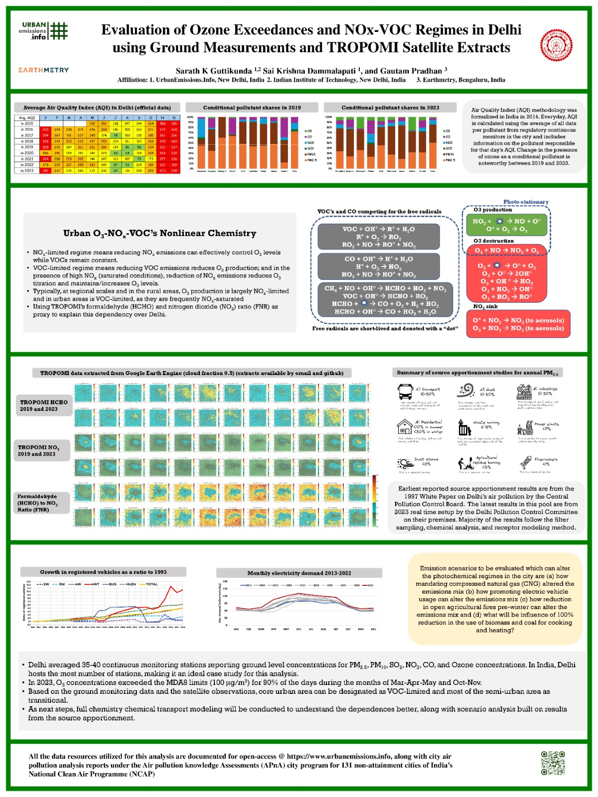

# Ozone Sensitivity

This research project is presented at the iCACGP-IGAC Conference 2024, Kuala Lumpur. [Abstract](https://icacgp-igac2024.com/wp-content/uploads/2024/08/C31.-Sarath-K-Guttikunda.pdf)

## FNR Plots  

1. [FNR Script - GEE](https://code.earthengine.google.com/a388006ea7b1e9c83005c1d53d5afd9e): This script is used to download the FNR tif for each month and season for the city of Delhi. 50 Cloud fraction is used in consistence with literature. All these FNR tifs are placed in the folder `data\FNR`
2. `FNR plots.ipynb` in the `scripts` folder plots the FNR as a PNG by considering 2.2-3.7 as the transition zone.

## MDA8

**Maximum Daily Average 8hours (MDA8)**: At every station, maximum 8hour mean on any given date. 

`MDA8.ipynb` in the `scripts` folder works with the hourly ozone concentrations at each station and calculates MDA8 stats for Delhi. Results are in `data\Results` folder.
